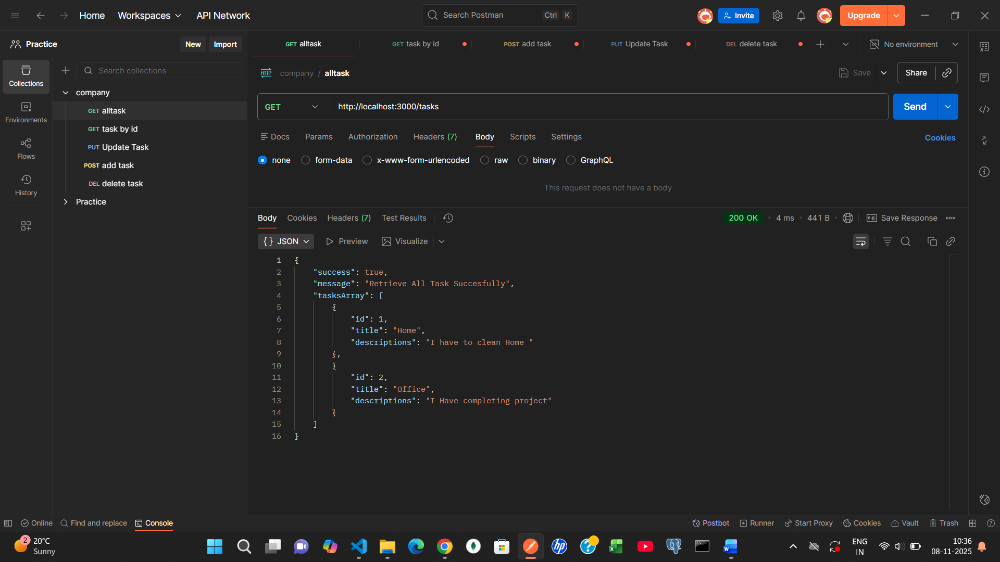
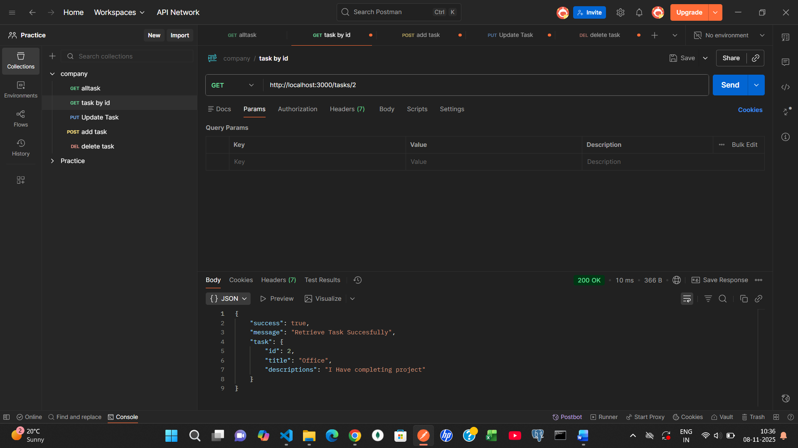
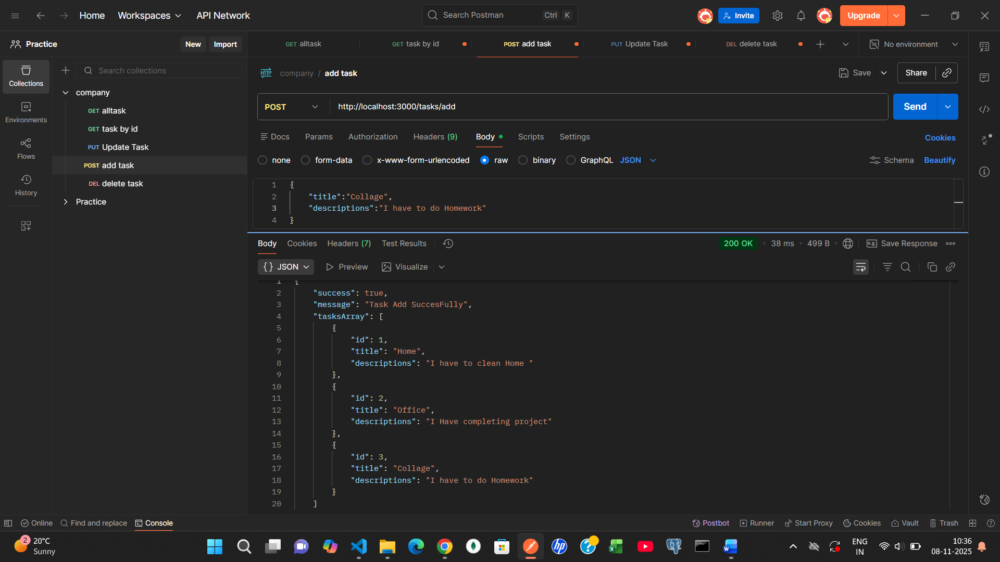
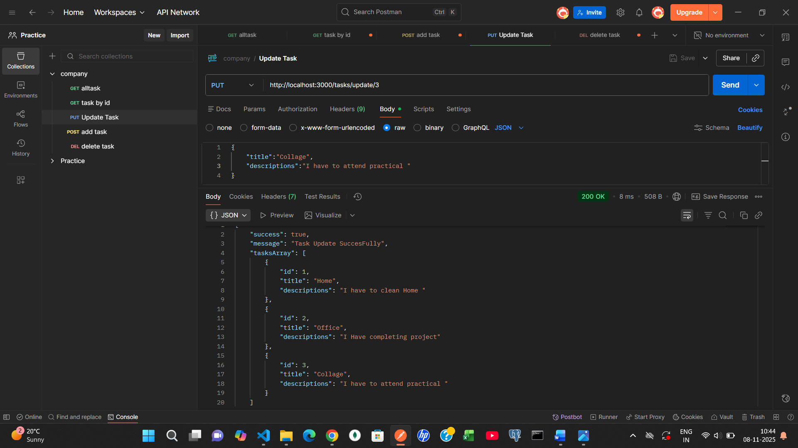
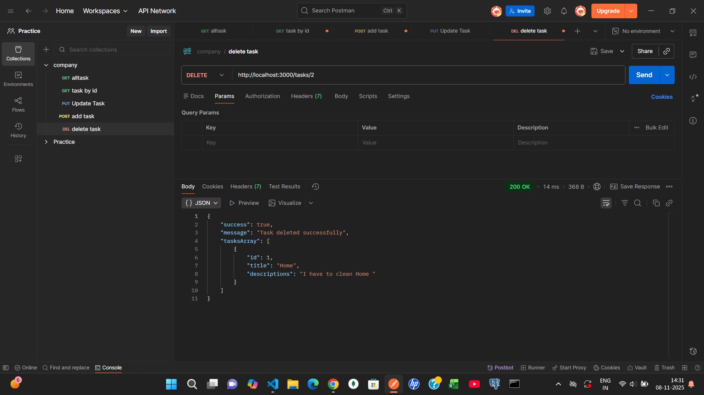

# BACKEND/FRONTEND
## I have build crud Operation without using any database as per company assignment
## Overview - This API lets you access tasks.

## ALL Request
### BaseURL-http://localhost:3000/tasks
-**-GET - http://localhost:3000/tasks**
-**-GET ID - http://localhost:3000/tasks/{id}**
-**-POST - http://localhost:3000/tasks/add**
-**-PUT - http://localhost:3000/tasks/update/{id}**
-**-DELETE - http://localhost:3000/tasks/{id}**


### 1.Retrieve a list of all tasks
```javascript
export const allTask = (req,res) => {
  try {
    if(!tasksArray){
      res.status(404).json({success: false,message: 'Tasks not found'})
    }
    res.status(200).json({
            success: true,
            message: 'Retrieve All Task Succesfully',
            tasksArray
        })
  } catch (error) {
    res.status(400).json({success: false,message:error.message})
  }
};
```

---
### 2.Retrieve a specific task by ID
```javascript
export const getTask = (req,res) => {
  try {
    const id = req.params.id;
    if(!id){
      return res.status(404).json({success: false,message: 'Required task Id'})
    }
    const task = tasksArray.find(task => task.id == id);
    if(!task){
      return res.status(404).json({success: false,message: 'This Task not found'})
    }
    res.status(200).json({
            success: true,
            message: 'Retrieve Task Succesfully',
            task
        })
  } catch (error) {
    res.status(400).json({success: false,message:error.message})
  }
};
```

---
### 3.Create a new task
```javascript
export const addTask = (req,res) => {
  try {
    const data = req.body;
    if(!data){
      res.status(404).json({success: false,message: 'Task are Required'})
    }
    tasksArray.push({ id: tasksArray.length + 1, title:data.title, descriptions:data.descriptions });
    res.status(200).json({
            success: true,
            message: 'Task Add SuccesFully',
            tasksArray
        })
  } catch (error) {
    res.status(400).json({
            success: false,
            message: error.message
        })
  }
}
```

---
### 4.Update an existing task by ID
```javascript
export const updateTask = (req,res) => {
  try {
    const task = tasksArray.find(task => task.id == req.params.id);
    if (!task) return res.status(404).json({ message: "task not found" });

    task.title = req.body.title;
    task.descriptions = req.body.descriptions;
    res.status(200).json({
            success: true,
            message: 'Task Update SuccesFully',
            tasksArray
        })
  } catch (error) {
    res.status(400).json({
            success: false,
            message: error.message
    })
  }
}

```

---
### 5.Delete a task by ID
```javascript
export const deleteTask = (req, res) => {
  try {
    const id = parseInt(req.params.id);
    if (!id) {
      return res.status(404).json({
        success: false,
        message: "Task ID is required",
      });
    }
    tasksArray = tasksArray.filter(task => task.id !== id);

    res.status(200).json({
      success: true,
      message: "Task deleted successfully",
      tasksArray,
    });

  } catch (error) {
    res.status(400).json({
      success: false,
      message: error.message,
    });
  }
};
```

---
## FRONTEND


